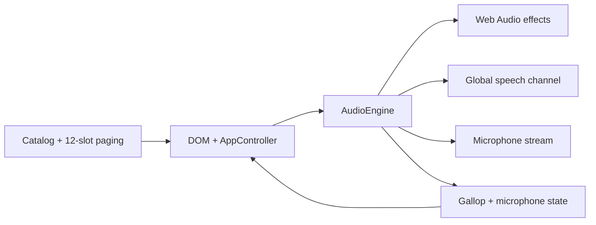

# Mobile Clownboard soundboard — Reviewer's guide

## What & why

[PR #1](https://github.com/bradyshutt/soundboard-clownboard/pull/1) turns the empty repository into a phone-first soundboard hosted on GitHub Pages. It provides sixteen large pads across two fixed 3×4 pages: fifteen immediate synthesized or spoken effects, a 30-second gallop with an independent loop control, and a live microphone-monitor toggle. The implementation stays dependency-free and creates every sound locally, avoiding downloads and licensed recordings.

## Key decisions (and their impact)

- Native HTML, CSS, and ES modules → no build step or runtime dependency → simple Pages rollback, at the cost of hand-owned browser APIs.
- Procedural Web Audio effects → instant, license-safe playback → timbre varies across speakers and intentionally favors character over studio realism.
- One shared gallop state machine → one-shot and loop modes cannot drift apart → pending intent must survive asynchronous first-time audio startup.
- Explicit microphone requesting/live/error/off lifecycle → permission and teardown are visible and deterministic → direct monitoring still requires headphones to avoid physical feedback.
- One global device-speech channel → matches the Web Speech API's actual queue semantics → “Yee-Haw” and “Howdy Partner” replace rather than overlap one another, and the latter remains a generic Western delivery.
- Branch-source Pages → works without a workflow-scoped credential and production maps directly to `main` → local gates and live smoke tests are not yet enforced by CI.

## Architecture

The declarative catalog owns pad identity and paging; the UI controller maps pad intent to a single audio engine; the engine exclusively owns Web Audio, speech, gallop mode, and microphone tracks. Page changes only rerender the catalog slice, so long-running audio persists. A persisted `pagehide` releases browser resources without invalidating the restored page; a final exit disposes the engine.

## Review this in ~15 minutes

**`src/audio-engine.js`** — Load-bearing and highest risk. Review context initialization, active-handle replacement, pending gallop intent, speech's global-channel contract, microphone request tokens, `release()` versus `dispose()`, and generated effect cleanup.

**`src/app.js`** — Load-bearing browser lifecycle and accessibility seam. Review pad-to-command mapping, sibling gallop loop control, state-derived labels, page navigation, and persisted versus final `pagehide` behavior.

**`src/catalog.js`** — Stable order and capability contract for all sixteen pads. Confirm the requested inventory, 12-slot pages, and eight page-two placeholders.

**`tests/audio-engine.test.js` and `tests/app.test.js`** — Proof for the risky state machines, including concurrent first-use loop taps, microphone request cancellation, teardown, global speech, and bfcache-aware release. `tests/catalog.test.js` is straightforward and safe to skim.

**`index.html` and `styles.css`** — Phone layout and interaction presentation. Confirm the 3×4 dynamic-viewport grid, safe areas, landscape adaptation, visible focus, reduced motion, and minimum practical tap areas.

**`README.md`, `.nojekyll`, and project docs** — Deployment/decision record; safe to skim after confirming Pages serves the repository root.

## Verification

- `npm test`: 17 passing Node tests across catalog, controller, audio lifecycle, gallop concurrency, microphone teardown, speech, and page-exit behavior.
- `npm run check`: all ES modules pass syntax validation.
- Local Chrome at 390×844 and 844×390: portrait and landscape layout inspection.
- Live HTTPS Pages preview: all 15 playback effects, both pages, loop → one-shot state, microphone live → off with a fake device, secure context, and asset loading; no browser exceptions.
- Not covered: subjective sound quality on physical phone speakers, real-device voice availability, and real microphone feedback characteristics. No CI check is installed because the available token cannot add workflow files.

## Risk & rollback

The main risk is browser-specific audio lifecycle behavior or acoustic feedback during direct monitoring; conservative output gain, visible headphone guidance, and deterministic track shutdown reduce it. Rollback is clean: revert the additive static-site commits and let branch-source Pages republish `main`.
